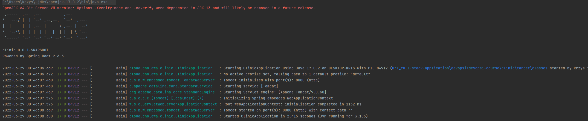

# Clinic Application

Simple API with CRUD methods using HashMap as repository

[Clinic](https://github.com/magikabdul/devopsi-course/tree/module-7-spring/clinic)

# Exchange Application

Simple API which communicates with external API (NBP)

[Exchange](https://github.com/magikabdul/devopsi-course/tree/module-7-spring/exchange)

