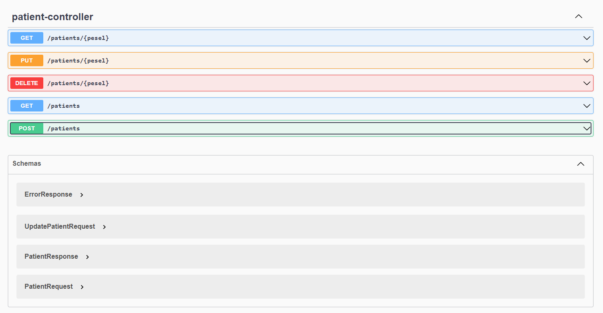
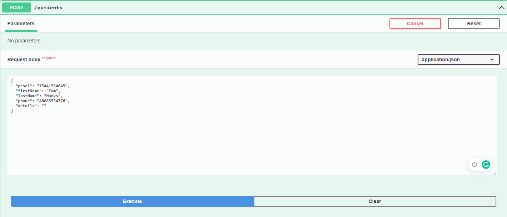
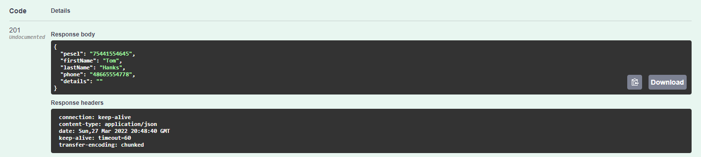
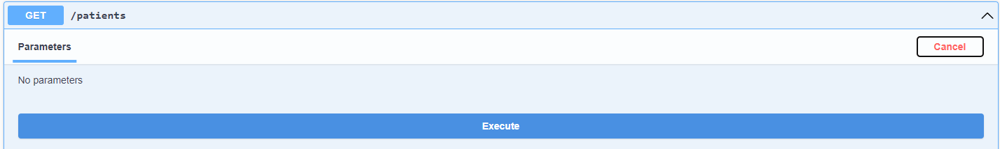
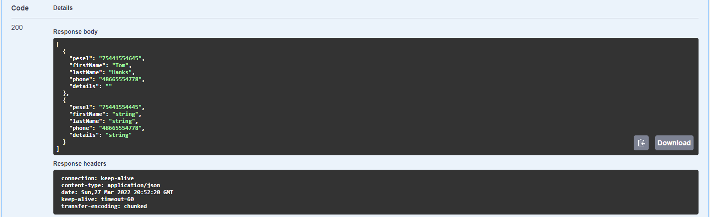
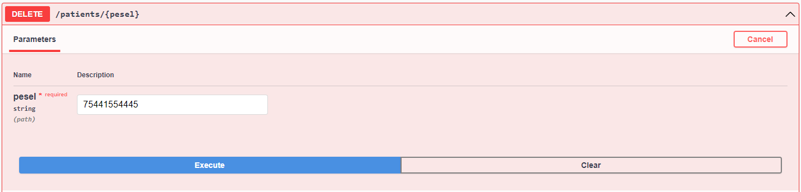
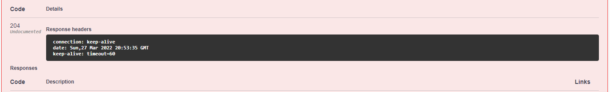
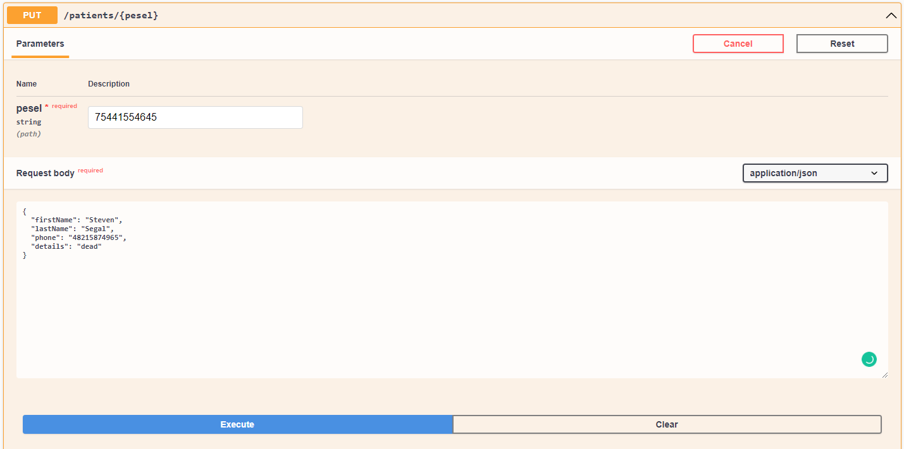
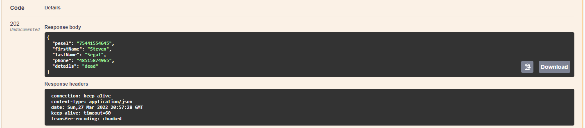

# Clinic Application

Simple API with CRUD methods using HashMap as repository

[Swagger](http://localhost:8080/swagger-ui/index.html)

## Screenshots

### MAIN VIEW

### POST

### GET

### DELETE

### UPDATE

