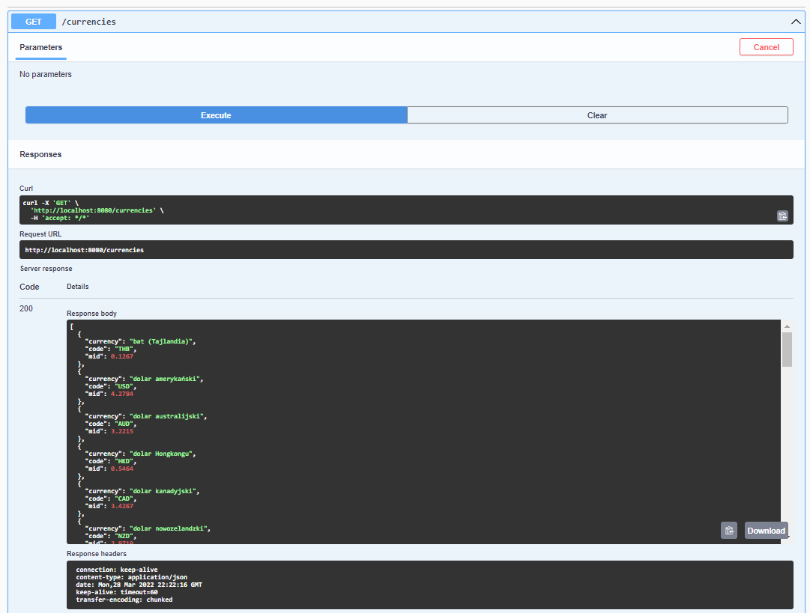

# Exchange Application

Simple API which communicates with external API (NBP)
- get all currencies
- convert currency
  - parameter data is optional (default: currentDate)
- save all currencies to csv file
  - parameter data is optional (default: currentDate)

[Swagger](http://localhost:8080/swagger-ui/index.html)

## Screenshots

### MAIN VIEW

### GET ALL CURRENCIES

### CONVERT CURRENCY 

### EXPORT TO FILE

